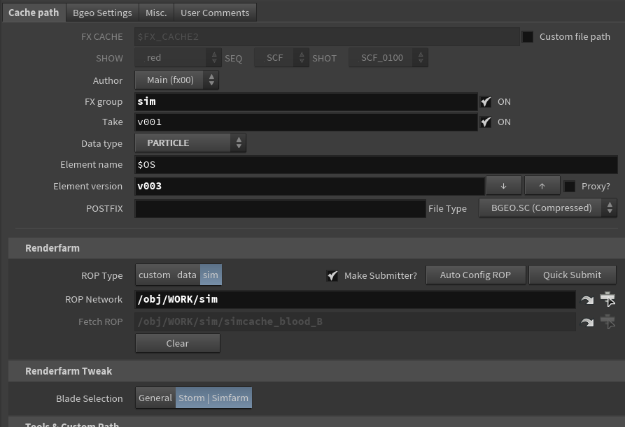

# 경력기술

## 주요업무

### 후디니 내부 파이프라인 개선

주요성과
- 후디니 내부에서 상 하위 네트워크를 자주 변경함에 있어 작업 효율이 떨어지는것을 고려하여 아티스트들의 피로도를 낮춰주고자 노력하였고 80% 이상 제작한 스크립트 및 툴들을 사용하고 있습니다.
- 업무 도중 발생할 수 있는 휴먼에러를 방지하여 업무 능률을 향상시켰습니다. 

#### File I/O 

주요내용
- 내부 툴에 대한 기능 추가
  - 랜더팜에 해당 job을 submit 하기 위해서 ropnet 내부 fetch 노드를 만들고 file cache 내부의 render rop을 연결해주어야 했으나
이런 과정들을 모두 반자동화 하여 스크립트를 생성하고 배포하였습니다.

기술 스택
- Python: 후디니를 파이썬을 이용하여 노드를 생성, 변경 등 조작을 할 수 있습니다.
- Pixar Tractor: 랜더팜에 job 을 submit 할 수 있습니다.

#### 샷 Automation 툴

주요내용 
- 프로그램 기획 및 개발
  - 샷 작업을 시작할 때 기본적인 노드부터, 카메라, 지오메트리 경로를 이전 작업하던 샷에서 복사해오거나 일일히 만들어야 했으나 모든 과정을 자동화하는 툴을 만들었습니다.
  - 매니지먼트 툴에서 작업자의 샷에 관련된 정보 (Start frame, End frame, FPS 등)들을 retrieve 할 수 있습니다. 

기술 스택
- Python (+hython): 후디니를 파이썬을 이용하여 노드를 생성, 변경 등 조작할 수 있고 외부 서버 정보를 가져올 수 있습니다.